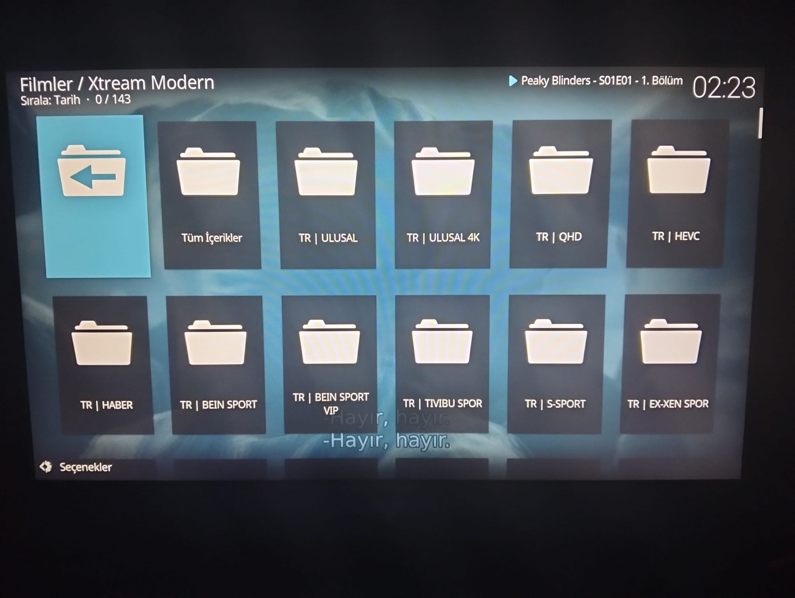
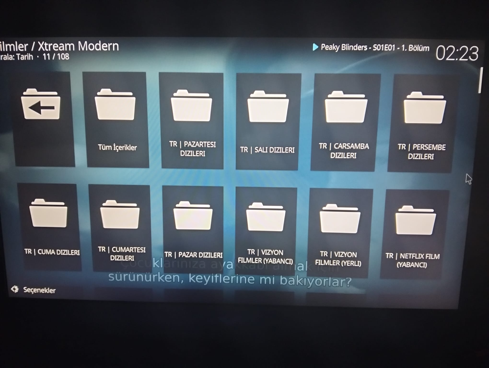
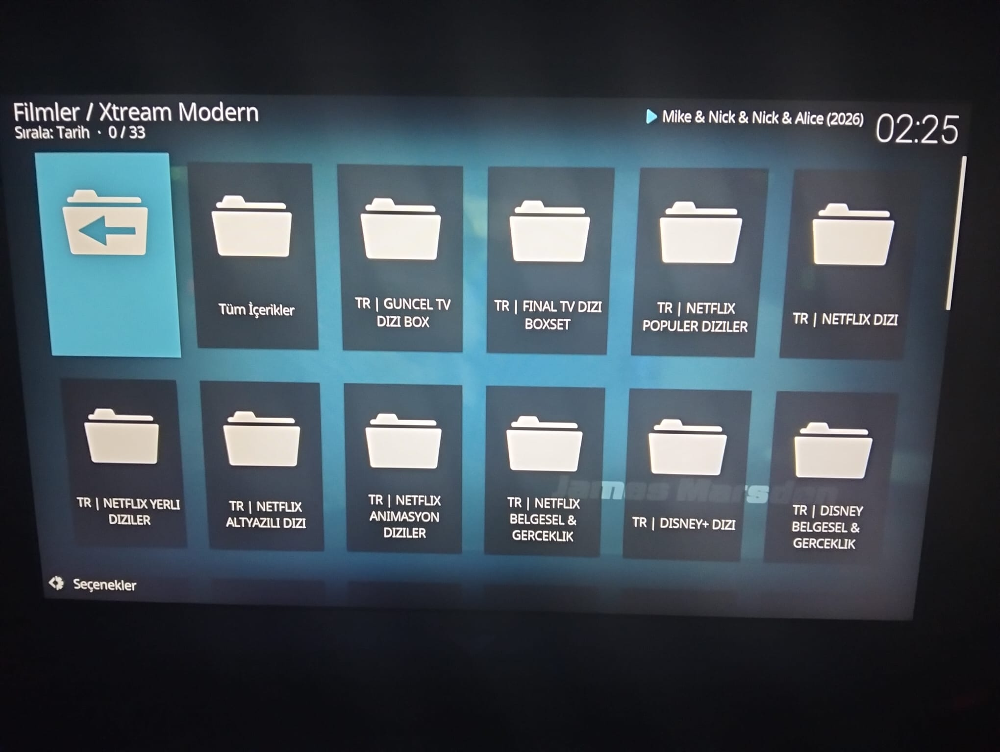

# 📺 Xtream IPTV Kodi Addon (Modern Edition)
**Netflix Arayüzü ile Optimize Edilmiş, Yüksek Performanslı IPTV Deneyimi**

---

> [!IMPORTANT]
> **XandyX Xtream IPTV**, standart Kodi listelerini rafa kaldırır. Tamamen poster odaklı, akıcı ve görsel bir kütüphane deneyimi sunar.

## 📸 Ekran Görüntüleri (Arayüz Turu)

  <table border="0">
    <tr>
      <td align="center" width="33%">
        
         <b>📡 Modern Ana Menü</b>
      </td>
      <td align="center" width="33%">
        
         <b>📺 Canlı TV Grupları</b>
      </td>
      <td align="center" width="33%">
        
         <b>🍿 Dizi Kategorileri</b>
      </td>
    </tr>
    <tr>
      <td align="center" width="33%">
        
         <b>🎬 Film Kütüphanesi</b>
      </td>
      <td align="center" width="33%">
        
         <b>🌐 Platform Odaklı Filtre</b>
      </td>
      <td align="center" width="33%">
        
         <b>📋 Poster Akış Tasarımı</b>
      </td>
    </tr>
  </table>

---

## ✨ Öne Çıkan Özellikler

- 🎨 **Sinematik Arayüz:** Tamamen poster ve afiş odaklı, modern Netflix tasarımı.
- ⚡ **Hızlı API Entegrasyonu:** Xtream kodlarıyla anında senkronizasyon ve düşük gecikme.
- 📂 **Akıllı Gruplandırma:** Canlı TV, VOD ve Diziler için otomatik kategorize edilmiş düzen.
- 🛠️ **Gelişmiş Skin Desteği:** Cam efekti (glass) ve neon detaylarla süslenmiş XML yapısı.

## 🚀 Kurulum Adımları

1. **İndirme:** Bu depodaki dosyaları `.zip` olarak indirin.
2. **Kodi Kurulumu:** `Eklentiler > Zip dosyasından yükle` yolunu takip edin.
3. **Giriş:** Eklenti ayarlarına giderek **Xtream API** (URL, Kullanıcı Adı, Şifre) bilgilerinizi girin.
4. **Keyfini Çıkarın:** Kurulum tamamlandıktan sonra ana ekrandan eklentiyi başlatın.

---

  
Bu proje <b>XandyX (Baykurt)</b> tarafından açık kaynak olarak geliştirilmektedir.

  
  

